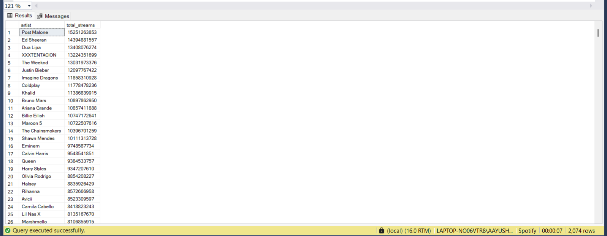

<p align="center">
  
</p>

<h1 align="center">🎵 Spotify Business Analysis using SQL</h1>

<p align="center">
End-to-End SQL Project | Data Analytics | Business Intelligence | SQL Server
</p>

<p align="center">


</p>

---

# 📑 Table of Contents

- Project Overview
- Business Problem
- Dataset Information
- Repository Structure
- Project Workflow
- Key Business Questions
- SQL Concepts Used
- Sample SQL Query
- Sample Query Output
- Business Insights
- Business Recommendations
- Skills Demonstrated
- Tools Used
- Author

---

# 📌 Project Overview

This project analyzes Spotify streaming data using SQL Server to uncover actionable business insights related to artist performance, audience engagement, content strategy, and audio characteristics.

Instead of solving isolated SQL problems, this project follows a real-world Data Analyst workflow by performing data quality checks, KPI analysis, business analysis, and strategic recommendations. It demonstrates how SQL can be used to answer business questions and support data-driven decision-making.

---

# 🎯 Business Problem

Music streaming platforms generate millions of user interactions every day. Understanding listener behavior, artist performance, and content effectiveness is critical for improving engagement and optimizing business strategy.

This project transforms raw Spotify streaming data into meaningful insights that can help stakeholders make informed decisions regarding:

- Artist promotion
- Content strategy
- Audience engagement
- Music release planning
- Distribution channel optimization

---

# 📊 Dataset Information

| Attribute | Details |
|-----------|----------|
| Dataset | Spotify Streaming Dataset |
| Format | CSV |
| Domain | Music Streaming Analytics |
| Analysis Tool | SQL Server |

---

# 📂 Repository Structure

```text
spotify-business-analysis-sql/
│
├── dataset/
│   ├── spotify.csv
│   └── data_dictionary.md
│
├── sql/
│   ├── 01_data_quality_checks.sql
│   ├── 02_kpi_analysis.sql
│   ├── 03_artist_analysis.sql
│   ├── 04_content_strategy.sql
│   ├── 05_audio_feature_analysis.sql
│   ├── 06_advanced_sql.sql
│   └── 07_business_analysis.sql
│
├── insights/
│   └── business_insights.md
│
├── images/
│   ├── spotify_logo.jpg
│   ├── top_artists_output.png
│   └── schema.png
│
├── README.md
└── LICENSE
```

---

# 📈 Project Workflow

- **Phase 1:** Data Quality Checks
- **Phase 2:** KPI Analysis
- **Phase 3:** Artist Performance Analysis
- **Phase 4:** Content Strategy Analysis
- **Phase 5:** Audio Feature Analysis
- **Phase 6:** Advanced SQL Analysis
- **Phase 7:** Business Analysis & Strategic Recommendations

---

# ❓ Key Business Questions

- Which artists generate the highest number of streams?
- Which artists have the highest audience engagement?
- Do singles outperform albums?
- Do official videos improve performance?
- Which audio characteristics are associated with successful songs?
- Which channels convert views into streams most effectively?
- Which artists consistently release successful tracks?
- Which artists have untapped growth potential?

---

# 🛠 SQL Concepts Used

- Aggregate Functions
- GROUP BY & HAVING
- CASE Statements
- Common Table Expressions (CTEs)
- Window Functions
- ROW_NUMBER()
- RANK()
- DENSE_RANK()
- LEAD() & LAG()
- Joins
- Subqueries
- Business KPI Calculations

---

# 💻 Sample SQL Query

```sql
SELECT
    artist,
    SUM(stream) AS total_streams
FROM spotify
GROUP BY artist
ORDER BY total_streams DESC;
```

---

# 📸 Sample Query Output


<p align="center">

</p>

---

# 💡 Business Insights

The analysis revealed several valuable business insights:

- High-performing artists contribute a significant share of the platform's total streams.
- Official videos generally receive higher audience engagement.
- Some distribution channels convert views into streams more effectively than others.
- Audio characteristics such as danceability and energy are associated with higher streaming performance.
- Release format influences audience engagement and listening behavior.

---

# 📌 Business Recommendations

- Increase promotional investment in high-performing release formats.
- Prioritize marketing through channels with higher stream conversion rates.
- Encourage artists to publish official videos to improve engagement.
- Identify emerging artists with high engagement but lower visibility for future promotion.
- Use audio feature trends to guide future music production and release strategies.

---

# 🚀 Skills Demonstrated

- SQL
- SQL Server
- Data Cleaning
- Exploratory Data Analysis (EDA)
- Business Analytics
- KPI Development
- Window Functions
- Ranking Functions
- Analytical Thinking
- Data Storytelling

---

# 🔧 Tools Used

- SQL Server
- Git
- GitHub

---

# 👨‍💻 Author

**Aayush Agarwal**

Aspiring Data Analyst passionate about transforming raw data into actionable business insights through SQL, Python, and Power BI.

⭐ If you found this project useful, consider starring the repository.
